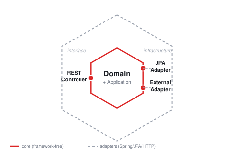

# Pokémon Collection

A fullstack demo app where trainers register, log in, browse Pokémon (data from
[PokéAPI](https://pokeapi.co/)) and build a personal collection.

- **Backend**: Java 21, Spring Boot 3, Maven — hexagonal architecture (ports & adapters) + DDD
- **Frontend**: React 19, TypeScript, Vite
- **Database**: PostgreSQL, schema-versioned with Flyway
- **Auth**: stateless JWT

## Quick start

Requires Docker and Docker Compose.

```bash
docker compose up --build
```

- Frontend: http://localhost:8081
- Backend API: http://localhost:8080/api
- Postgres: localhost:5434

Register a trainer, log in, browse Pokémon and add some to your collection.
Stop with `docker compose down` (add `-v` to also drop the database volume).

### Running the pieces individually

**Backend** (needs Postgres reachable at `DB_URL`, e.g. `docker compose up db`;
`JWT_SECRET` is required

**Frontend** (proxies `/api` to `localhost:8080` in dev):

```bash
cd frontend
npm install
npm run dev
```

## Tests

```bash
cd backend && ./mvnw test   # domain unit tests, MockMvc slices, one full
                             # Spring Boot integration test, ArchUnit boundary checks
cd frontend && npm test     # Vitest + React Testing Library
```

## Architecture

Three bounded contexts under `backend/src/main/java/com/mbls/challenge/pokemon/`,
each layered `domain` → `application` → `adapter`:

- **trainer** — identity & auth (register, login, password hashing, JWT)
- **catalog** — anti-corruption layer around PokéAPI
- **collection** — core domain: a trainer's personal Pokémon collection
- **shared** — shared kernel (`TrainerId`, `PokemonId`, `PageResult`) + cross-cutting concerns (JWT filter, security config, CORS, caching, exception mapping)

Dependencies point inward only — `domain`/`application` never import Spring,
JPA, or HTTP; adapters (`adapter.in.web`, `adapter.out.persistence`,
`adapter.out.pokeapi`) are the only layer that does. An ArchUnit test
(`ArchitectureTest`) enforces this mechanically. Contexts don't depend on each
other's domain models directly: `collection` reaches `catalog` only through an
outbound port and a thin bridge adapter (`CatalogPokemonLookupAdapter`).



## API overview

| Method | Path                    | Auth | Description                          |
|--------|-------------------------|------|---------------------------------------|
| POST   | `/api/auth/register`    | no   | Create a trainer account, returns a JWT |
| POST   | `/api/auth/login`       | no   | Log in, returns a JWT                |
| GET    | `/api/pokemon`          | yes  | Paginated Pokémon list (`page`, `size`, `search`) |
| GET    | `/api/pokemon/{id}`     | yes  | Pokémon details                      |
| GET    | `/api/collection`       | yes  | The current trainer's collection     |
| POST   | `/api/collection/{id}`  | yes  | Add a Pokémon to the collection      |
| DELETE | `/api/collection/{id}`  | yes  | Remove a Pokémon from the collection |

JWT via `Authorization: Bearer <token>`; logout is client-side (token
discarded). Errors are RFC 7807 `application/problem+json`. Auth endpoints are
rate-limited per IP (`app.rate-limit.*`, default 20 req/60s). PokéAPI calls
use a Resilience4j retry + circuit breaker.

## Known limitations

- No token refresh — re-login after expiry (`app.jwt.expiration-minutes`, default 2h).
- PokéAPI response cache is unbounded in-memory, no TTL/eviction — fine for one instance, not multi-instance (would want Redis).
- No per-account lockout on failed logins, only the per-IP rate limit — an attacker spread across IPs could still brute-force one account.
